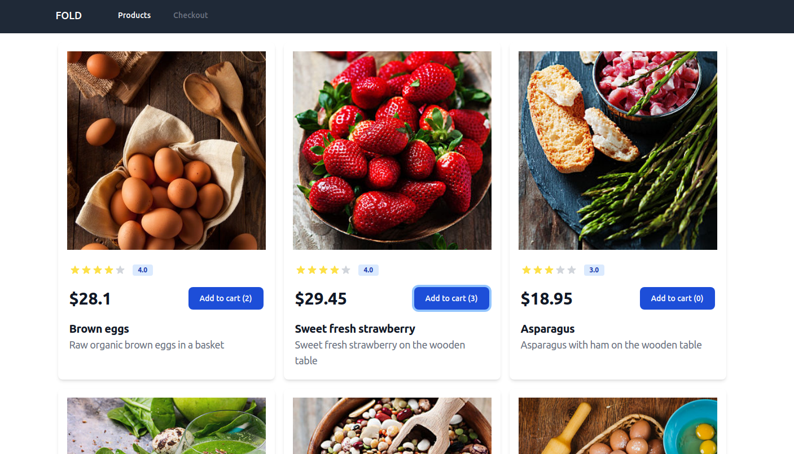
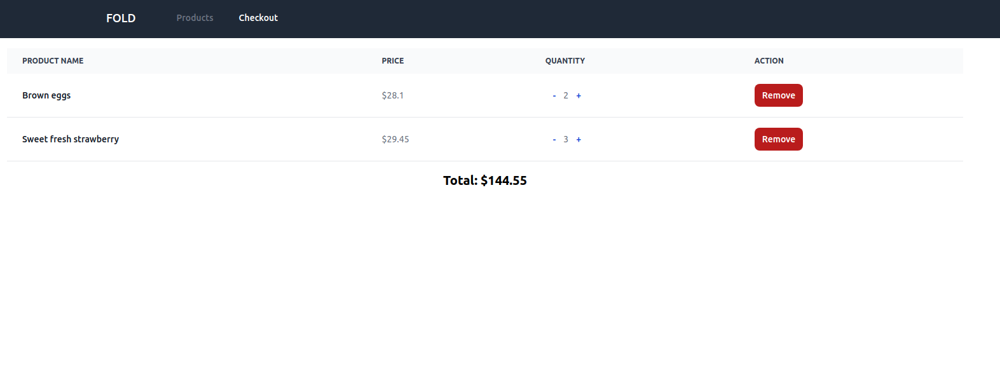
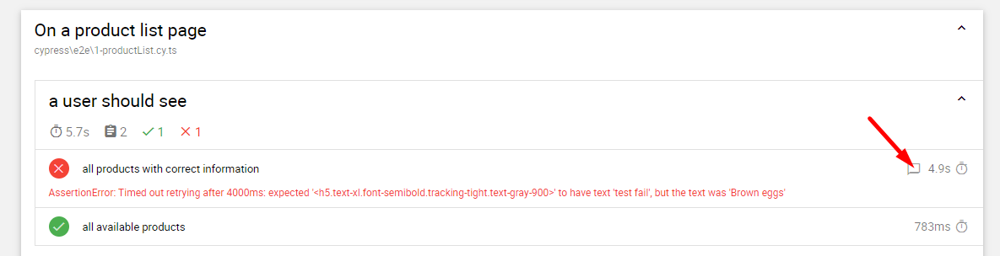
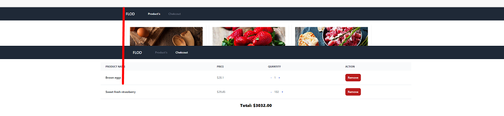

# Fold Cart and Checkout Application

## Screenshot

## Technologies used

- React
- Lodash
- Typescript
- React-router
- Tailwind CSS
- React testing library
- Redux toolkit (Redux thunk)

## How to setup and run the application
- `cd into the root folder`
- run `$ npm install` at the root level of the folder to install dependencies
- run `$ npm start` to launch on `http://localhost:3000`

#### Product List Page User story : DONE

- As a user, I need to be able to see a list of products. Include `title`, `image`, `description` and `price`
- As a user, I need to be able to add products to my cart.

#### Global Navigation user story : DONE

- As a user, I should be able to go back and forth between the pages whilst preserving the state of the basket.

#### Cart Page user story : DONE

- As a user, I should be able to see the various items I have added and their quantities.

- As a user, I need to be able to remove an item from my Basket

#### E2E Automation : PENDING

You are tasked with; 
- Automating the e2e for this application using your preferred framework of choice. The automation should cover the core functionality outlined in the user stories above. Feel free to modify the code to assist with your testing.
- Implement the test cases using the Page Object Model design pattern.
- Generate a test report that includes the test case status, screenshots of any failed test cases, and any additional information that may be useful for debugging.
- List in this README any issues and improvements (ux/performance) you think can be made to better the app.
- Use any version control system (e.g. Git) to track your code changes and push your code to a remote repository.
- Provide in this README instructions on how to run the tests and any additional information about your solution.
- Have fun and don't stress out!

## E2E Automation

* `cd into the root folder`, update `$ npm install`
* run `$ npm start` to launch `http://localhost:3000`

* run `$ npm run e2e:report` to run tests in headless mode and create report: 
    - HTML Report will be available after run is completed 
    - Navigate to cypress\reports\html\index.html find the report 
    - Open it in any browser 
    - To access screenshots of failed tests click on test content icon: 

      

* run `$ npm run e2e:open` to playback tests one by one: 
    - Cypress window will be opened 
    - Navigate to "E2E Testing" option 
    - Select "Chrome" (should be pre-installed on your machine) 
    - Click "Start E2E Testing in Chrome"

#### Issues and improvements
1. Company name on nav bar
    - actual: FLOD
    - expected: FOLD
2. Products tab name on nav bar
    - actual: Product's 
    - expected: Products
3. Checkout tab name on nav bar
    - actual: Chekcout 
    - expected: Checkout 
4. Minus sign of items quantity on "Add to cart" button
    - actual:  Add to cart (-0), Add to cart (-2)
    - expected: without minus sign
5. Different width of content on Products and Checkout pages when displaying on widescreen 
leads to inconstancy of nav bar centering when switching tabs
    - actual:
      
     - expected: uniform position of nav bar when switching tabs
6. Items on Products page should be ordered by price/rating/category/alphabet
7. URL of Products page should contain '/products'
